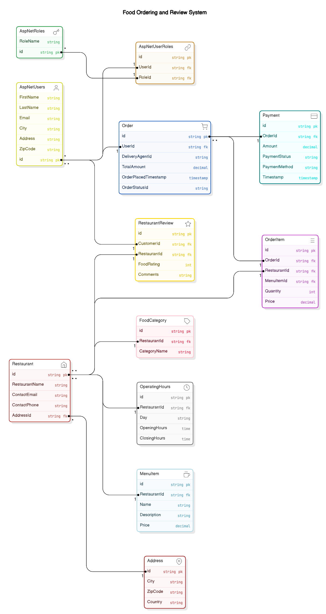
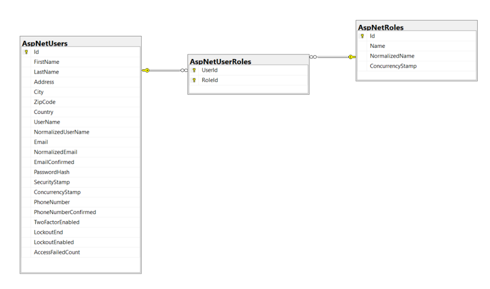
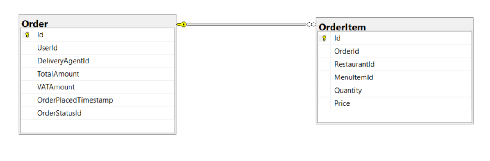
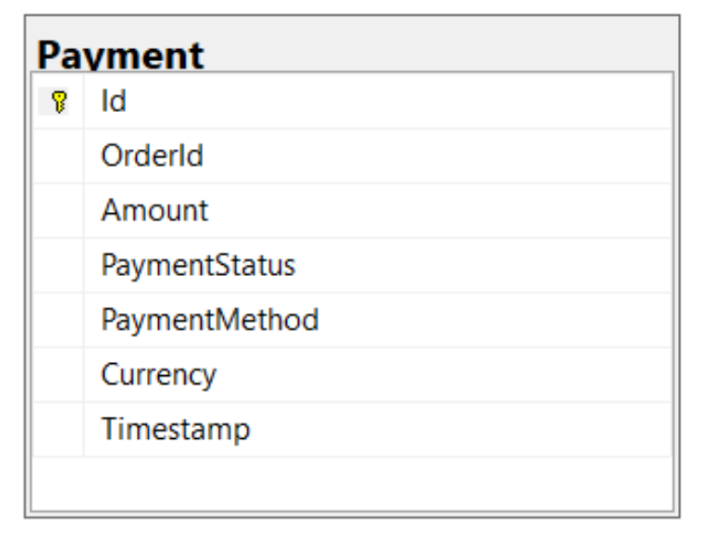
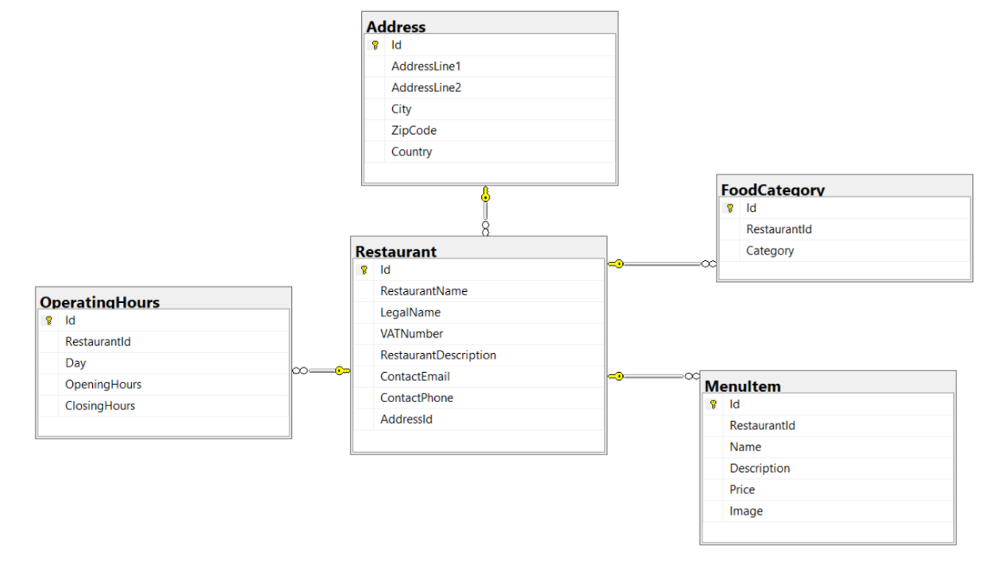
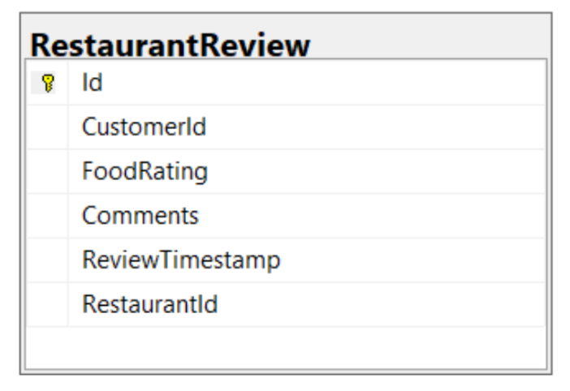

# **MTOGO \- Software Exam Project**

### **How to run our project**

**Docker Compose:**  
Have Docker installed on your desktop and run docker-compose up \--build in the root of the project. (Not fully implemented yet).

**Run without Docker:**

1. Clone our repository “git clone [https://github.com/christofferPerch/MTOGO\_Soft\_Exam.git](https://github.com/christofferPerch/MTOGO_Soft_Exam.git)”  
     
2. Import the BACPAC files located [HERE](./Documentation/BacpacFiles/) containing the MSSQL databases into your SQL server.   
     
3. Check appsettings.development.json files in each microservice project and ensure the connection string for the MSSQL database is using the correct server.   
     
4. Setup Redis through docker: docker run \-d \--name redis-stack-server \-p 6379:6379 redis/redis-stack-server:latest  
     
5. Setup RabbitMQ through docker: docker run \-d \--name rabbitmq \-p 5672:5672 \-p 15672:15672 rabbitmq:3-management  
     
6. Configure Startup Projects in Visual Studio make sure it uses Multiple startup projects and starts everything except the MTOGO.MessageBus, MTOGO.DataAccess and MTOGO.UnitTests projects.   
     
7. It should now open the API Gateway and Web Project when running the application.

   ### **Technology Stack**

   #### **Version Control Platform:**

* **Git:** Version control for collaborative development.  
* **GitHub:** Repository hosting.

  #### **Development Environment:**

* **Visual Studio:** For coding and debugging.  
* **Swagger:** API documentation for testing and understanding endpoints.  
* **Redis Commander:** For managing the Redis database.  
* **SSMS:** For managing the SQL databases.

  #### **Development Stack**

  #### **Backend Development:**

* **C\# and .NET Core:** For developing microservices.

  #### **Database Management:**

* **Microsoft SQL Server:** Primary database for most services.  
* **Redis:** Temporary storage for shopping cart data.

  #### **Message Queue:**

* **RabbitMQ:** Facilitates communication between microservices.

  #### **Development Tools:**

* **Docker:** Containerization for consistent environments. used for rabbitmq and redis.  
* **Docker Compose:** For putting it all together.   
* **Ocelot:** Used for the API gateway.  
* **Dapper:** Used for data access and ORM purposes.

  #### **CI/CD Pipeline:**

* **In Progress:** Will be used to make code analysis, run tests and docker. 

## **Ubiquitous Language** 

### **Entities:**

* **Customer:** The user placing an order.  
* **DeliveryAgent:** The individual delivering the food.  
* **Restaurant:** A business preparing food that can be ordered through the MTOGO platform.  
* **Menu:** A list of food items offered by a restaurant.  
* **Menu Item:** Individual dishes or offerings on the menu, available for customers to order.  
* **Order:** A food request made by a customer through the platform.  
* **Shopping Cart:** A temporary collection of items selected by a customer before placing an order.  
* **Review:** Feedback provided by customers for restaurants, including food ratings and comments.  
* **Address:** The location associated with restaurants or users.  
* **Food Category:** The type of cuisine or food offerings associated with a restaurant.

## **Architecture Documentation**

### **Project Structure:**

### **Microservices**

Each microservice is self-contained and responsible for its domain:

* **MTOGO.Services.AuthAPI**  
* **MTOGO.Services.ShoppingCartAPI**  
* **MTOGO.Services.OrderAPI**  
* **MTOGO.Services.EmailAPI**  
* **MTOGO.Services.RestaurantAPI**  
* **MTOGO.Services.ReviewAPI**

### **API Gateway**

The gateway solution is built with Ocelot, it creates an API gateway where we can access all of our microservice’s API endpoints through Swagger.

* **MTOGO.GatewaySolution**

### **Web Project**

Our web project implements the microservices through our API gateway, we created this to show the full flow of the system. 

* **MTOGO.Web**

### **Integration**

This project contains our RabbitMQ logic which we use in our microservices to publish and subscribe to messages/queues.

* **MTOGO.MessageBus**

**TODO \- TESTS**

---

## **Project Structure**

### **General Microservice Folder Structure:**

**`├── Properties`**

	├───────── launchSettings.json # Startup config

**`├── Controllers/`**    `# API controllers`

**`├── Models/`**         `# Data models and DTOs`

**`├── Dto/`**

**`├── Services/`**       `# Business logic services and interfaces`

	├───────── IServices/

**`├── Data/`**           `# Database context and migrations`

**`├── Program.cs`**      `# Application entry point`

**`├── Dockerfile`**      

**`└── appsettings.json`** `# Configuration settings`

---

## **Requirements and Diagrams**

**Domain Diagram:**

**EER Diagrams:**

**Auth Service:**

**OrderServiceDB:**

**PaymentDB:**

**RestaurantServiceDB:** 

**ReviewServiceDB:**

## **Test Strategy and Design**

### **Testing Goals:**

1. **Functional Testing:** Verify business logic works as intended.  
2. **Performance Testing:** Ensure scalability and responsiveness.  
3. **Reliability Testing:** Handle and recover gracefully from failures.

### **Types of Tests:**

* **Unit Tests:** For isolated business logic.  
* **Integration Tests:** Verify interactions between components.

### **Tools:**

* **xUnit** for testing in C\#.  
* **Swagger** for API testing.

### **Test Coverage:**

* 70-80% for critical business logic.

---

## **Branching Strategy**

We follow **GitHub Flow**:

* Feature branches for individual tasks.  
* Pull requests to merge changes into the main branch.

---

## **Agile Practices**

We use **XP Practices**:

* Pair Programming.  
* Continuous Integration and Delivery.

---

## **Non-Functional Requirements (FURPS Model)**

**Usability**

\- Comprehensive API documentation is available via Swagger for developers to easily interact with the system.

\- Secure and user-friendly error handling ensures clear feedback for users and developers in case of issues.

\- Redis is used to store shopping cart data temporarily, enhancing user experience during browsing.

**Reliability**

\- Ensures the integrity of order data across services through RabbitMQ-based message queuing.

\- Logging and monitoring in all services to track errors and critical events, with detailed logs to assist in debugging.

**Performance**

\- Load testing planned for high concurrency scenarios to simulate realistic user load.

\- Optimized database queries (SQL Server) for better performance and faster response times.

\- Caching using Redis improves performance for frequently accessed data, such as shopping cart operations.

**Supportability**

\- Developer-friendly project structure with clear separation of concerns across services.

\- Comprehensive developer documentation, including code organization, API usage, and message queue setup.

\- Configurable environment variables and Docker support to streamline deployment and scaling.

## 
