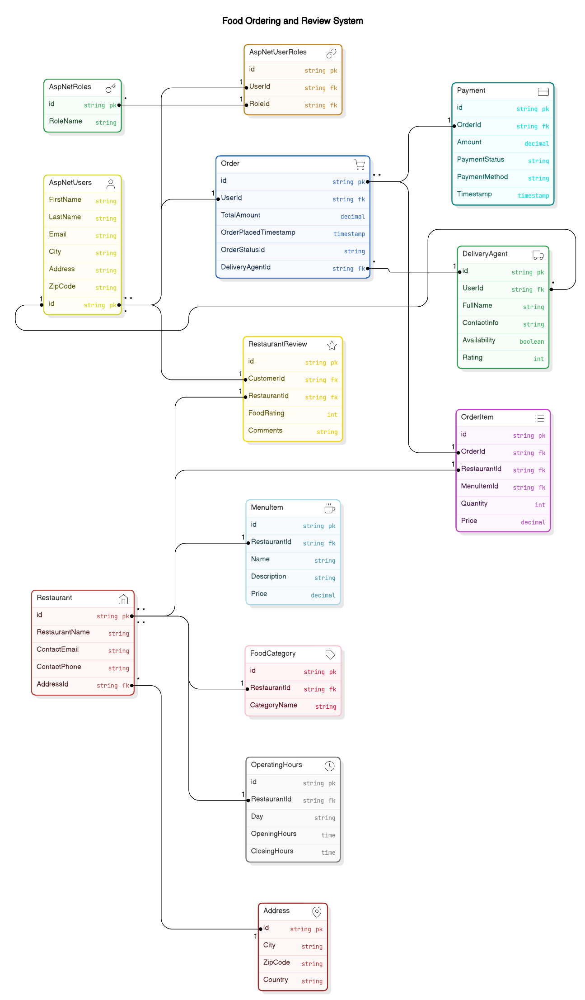
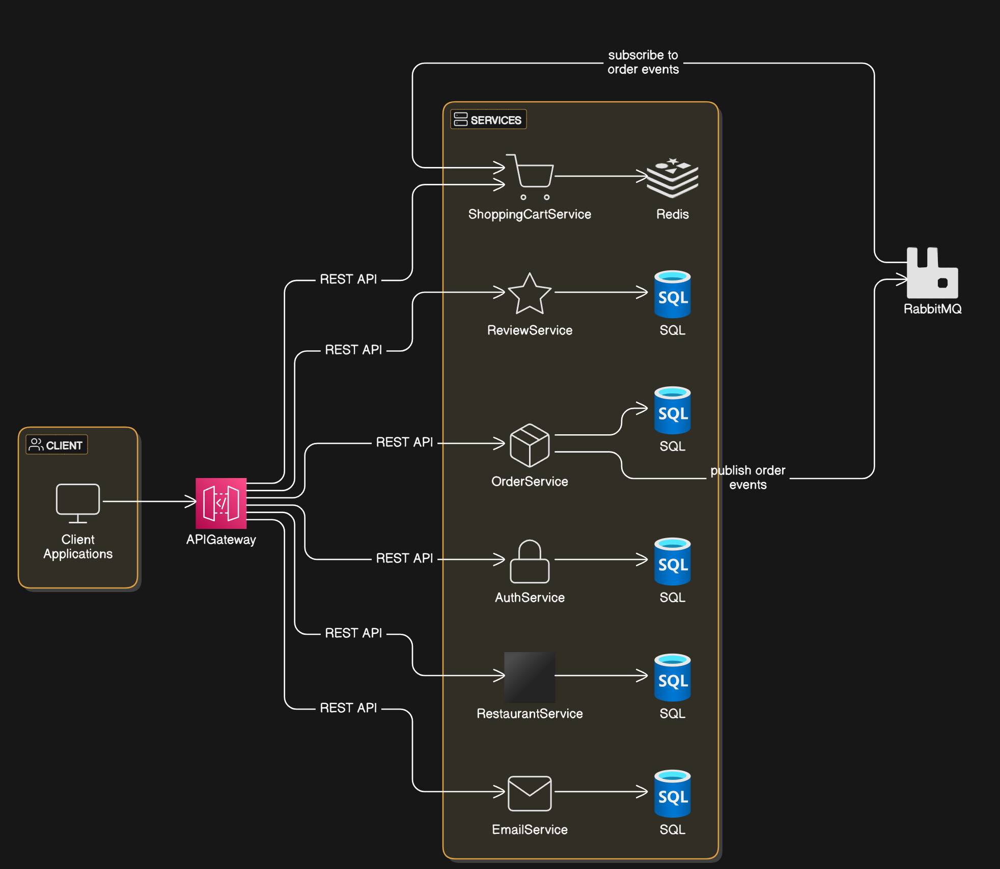

# **MTOGO \- Software Exam Project**

### **How to run our project**

**Docker Compose:**  
Have Docker installed on your desktop and right click on the docker-compose in the project and select "Compose Up". You might have to clean the solution and build it first if any errors occour. 

**Run without Docker:**

1. Clone our repository “git clone [https://github.com/christofferPerch/MTOGO\_Soft\_Exam.git](https://github.com/christofferPerch/MTOGO_Soft_Exam.git)”  
     
2. Import the BACPAC files located [HERE](./Documentation/BacpacFiles/) containing the MSSQL databases into your SQL server.   
     
3. Check appsettings.development.json files in each microservice project and ensure the connection string for the MSSQL database is using the correct server.   
     
4. Setup Redis through docker: docker run \-d \--name redis-stack-server \-p 6379:6379 redis/redis-stack-server:latest  
     
5. Setup RabbitMQ through docker: docker run \-d \--name rabbitmq \-p 5672:5672 \-p 15672:15672 rabbitmq:3-management  
     
6. Configure Startup Projects in Visual Studio make sure it uses Multiple startup projects and starts everything except the MTOGO.MessageBus, MTOGO.DataAccess and MTOGO.UnitTests projects.   
     
7. It should now open the API Gateway and Web Project when running the application.

# User Stories

In our project, we utilized user stories to capture the requirements and expectations of the system’s stakeholders. These stories form the foundation of our development process, focusing on delivering value to customers, administrators, restaurant owners, delivery agents, and the system itself.

## User Story 1
**As a Customer, I want to register on the website, so that I can create an account to place orders and track my activities.**

## User Story 2
**As a Customer, I want to log in to the website, so that I can access my account, create orders and view my orders.**

## User Story 3
**As a Customer, I want to update my profile, so that I can keep it up to date with my correct information and address.**

## User Story 4
**As a Customer, I want to delete my profile, so that my information is removed from the system.**

## User Story 5
**As an Admin, I want to be able to create a restaurant and assign a restaurant owner to it, so that they can manage their restaurant.**

## User Story 6
**As a Customer, I want to search for restaurants by zip code or food category, so that I can find options near me or with specific cuisine types.**

## User Story 7
**As a Restaurant Owner, I want to add menu items to my restaurant’s page, so that customers can view and order the food we offer.**

## User Story 8
**As a Restaurant Owner, I want to delete menu items from my restaurant’s page, so that outdated or unavailable items are not shown to customers.**

## User Story 9
**As a Restaurant Owner, I want to update existing menu items, so that customers have accurate information on the menu.**

## User Story 10
**As a Restaurant Owner, I want to update my restaurant’s details (such as hours, location, and contact information), so that customers have the latest information.**

## User Story 11
**As a Customer, I want to add menu items from a restaurant to my shopping cart, so that it becomes a part of my final order.**

## User Story 12
**As a Customer, I want to be able to view my shopping cart, so that I can see what is in it, before I place the order.**

## User Story 13
**As a Customer, I want to update items in my shopping cart, so that I can adjust my order before checking out.**

## User Story 14
**As a Customer, I want to remove items from my shopping cart, so that I can adjust my order as needed.**

## User Story 15
**As a Customer, I want to pay for items in my shopping cart, so that an order is created and processed for delivery.**

## User Story 16
**As a Customer, I want to view the status of my active order, so that I know when to expect delivery.**

## User Story 17
**As a Customer, I want to view my previous orders, so that I can review past purchases.**

## User Story 18
**As a Customer, I want to leave feedback on the restaurant with a rating and comment, so that other customers in the future know what to expect.**

## User Story 19
**As a Customer, I want to be able to remove or update my reviews on a restaurant, so that the reviews are always up to date.**

## User Story 20
**As a Customer, I want to view the reviews on a specific restaurant, so that I know what to expect of the restaurant.**

## User Story 21
**As a System, when a customer places an order, I want to send them an order confirmation email, so that they verify their order.**

## User Story 22
**As an Admin, I want to be able to set up an account for a delivery agent, so that they can start delivering orders.**

## User Story 23
**As a Customer, I want to choose my preferred language (English or Danish) during registration, so that I can use the website in my preferred language.**

## User Story 24
**As a Customer, I want to receive an email or SMS notification after successful registration, so that I am informed that my account was created.**

## User Story 25
**As a Restaurant Owner, I want to view the total fees paid to MTOGO for my orders, so that I can track my expenses for using the service.**

## User Story 26
**As a Restaurant Owner, I want to view the breakdown of fees per order, so that I understand how the variable fees are calculated based on the order value.**

## User Story 27
**As a Customer, I want to receive SMS or app updates as my order status changes, so that I am informed of the progress of my delivery.**

## User Story 28
**As an Admin, I want to define bonus rules for delivery agents (based on order value, working hours, and customer reviews), so that bonuses are automatically calculated.**

## User Story 29
**As a Delivery Agent, I want to view my bonus details for completed deliveries, so that I know how my earnings were calculated.**

## User Story 30
**As a System, I want to call the external payment processing service when a customer places an order, so that the payment is processed securely.**

## User Story 31
**As a Customer, I want to leave a review for the delivery agent in addition to the restaurant, so that I can provide feedback on their service.**

## User Story 32
**As a System, I want to send a feedback request to the customer after order delivery, so that they can rate the service.**

## User Story 33
**As a Manager, I want to view the total number of open orders in real-time, so that I can monitor the system's performance.**

## User Story 34
**As a Manager, I want to see average orders placed over a 24-hour period, so that I can analyze customer activity trends.**

## User Story 35
**As a Manager, I want to view the average processing time for orders, so that I can assess system efficiency.**

## User Story 36
**As a System, I want to send an SMS or app notification to the customer when their order is picked up by the delivery agent, so that they know the delivery is en route.**

## User Story 37
**As a Customer, I want to be able to choose between receiving order updates via SMS or the app, so that I can receive notifications in my preferred way.**

## User Story 38
**As an Admin, I want to onboard a new restaurant owner with an account and access permissions, so that they can manage their restaurant details and orders.**

## User Story 39
**As a System, I want to be able to handle an increase in the number of customers and orders, so that the service remains reliable as the user base grows.**

## User Story 40
**As a System, I want to support adding a complaints module in the future, so that customer and supplier complaints can be managed efficiently.**

Below are examples of user stories from our project with detailed acceptance criteria:

## Examples with Detailed Acceptance Criteria

### **User Story 1**  
**As a Customer, I want to register on the website, so that I can create an account to place orders and track my activities.**

**Acceptance Criteria:**  
- **Scenario: Successful registration on the website**  
  Given that I am on the registration page  
  When I enter all required information (full name, email address, phone number, address, password, and confirm password) with valid data  
  Then my account is created and I am assigned the "Customer" role by default, so that I have appropriate access and permissions for ordering.  

- **Scenario: Registration with existing email**  
  Given that I attempt to register with an email already in use  
  When I submit the registration form  
  Then I see an error message stating that the email is already registered and my account is not created.  

- **Scenario: Password validation failure**  
  Given that I enter a password not meeting the complexity requirements  
  When I submit the registration form  
  Then I see an error message explaining the password requirements.  
  _Complexity requirements: Minimum 8 characters, at least one uppercase letter, one lowercase letter, one numeric digit, and one special character._  

---

### **User Story 2**  
**As a Customer, I want to log in to the website, so that I can access my account and view my orders.**

**Acceptance Criteria:**  
- **Scenario: Successful login**  
  Given that I have a registered account and am on the login page  
  When I enter my valid email and password  
  Then I am logged in, and I am redirected to my account dashboard.  

- **Scenario: Invalid login credentials**  
  Given that I enter an incorrect email or password  
  When I attempt to log in  
  Then I see an error message indicating "Invalid credentials."  

- **Scenario: Password recovery (not implemented yet)**  
  Given that I have forgotten my password and am on the login page  
  When I click on "Forgot Password" and provide my registered email  
  Then I receive an email with instructions to reset my password.  

- **Scenario: Account lock after multiple failed login attempts (not implemented yet)**  
  Given that I enter incorrect login credentials multiple times (e.g., 5 failed attempts)  
  When I attempt another login  
  Then my account is temporarily locked, and I see a message indicating "Too many failed attempts. Your account has been locked. Please try again later or reset your password."  

---

### **User Story 6**  
**As a Customer, I want to search for restaurants by zip code or food category, so that I can find options near me or with specific cuisine types.**

**Acceptance Criteria:**  
- **Scenario: Successful restaurant search by zip code**  
  Given that I am on the restaurant search page  
  When I enter a valid zip code and click search  
  Then I see a list of restaurants near that zip code with details such as name, location, and average rating.  

- **Scenario: Successful restaurant search by food category**  
  Given that I am on the restaurant search page  
  When I select one or more food categories (e.g., Italian, Vegan) and click search  
  Then I see a list of restaurants that match the selected categories.  

- **Scenario: Combined search by zip code and food category**  
  Given that I am on the restaurant search page  
  When I enter a valid zip code and select one or more food categories  
  Then I see a list of restaurants near that zip code that match the selected food categories.  

- **Scenario: Invalid zip code entry**  
  Given that I enter an invalid zip code format in the search bar  
  When I attempt to search  
  Then I see an error message instructing me to enter a valid zip code.  

- **Scenario: No search results**  
  Given that I search for restaurants with criteria that don’t match any available restaurants  
  When I click search  
  Then I see a message stating "No results found for your search criteria."  

---

### **User Story 15**  
**As a Customer, I want to pay for items in my shopping cart, so that an order is created and processed for delivery.**

**Acceptance Criteria:**  
- **Scenario: Successful payment**  
  Given that I have items in my shopping cart  
  When I enter valid payment details and click “Pay Now”  
  Then I see a confirmation message that my payment was successful, and an order is created with a status of “Processing.”  

- **Scenario: Failed payment due to invalid details**  
  Given that I have items in my shopping cart  
  When I enter invalid payment details and click “Pay Now”  
  Then I see an error message and am prompted to re-enter my payment details.  

- **Scenario: External service failure**  
  Given that I have items in my shopping cart  
  When I attempt to pay and the payment service is unavailable  
  Then I see an error message stating the service is temporarily unavailable.  

- **Scenario: Empty cart prevention**  
  Given that my shopping cart is empty  
  When I attempt to proceed to payment  
  Then I see a message stating that I cannot proceed without adding items to my cart.  

---

### **User Story 21**  
**As a System, when a customer places an order, I want to send them an order confirmation email, so that they verify their order.**

**Acceptance Criteria:**  
- **Scenario: Successful order confirmation email**  
  Given that a customer has successfully placed an order  
  When the system processes the order  
  Then an order confirmation email is sent to the customer’s registered email address and the email contains order details and a unique order ID.  

- **Scenario: Failed email delivery**  
  Given that a customer has placed an order  
  When the email service is unavailable  
  Then the system logs the failure and retries sending the email after a defined interval.  

- **Scenario: Invalid email address**  
  Given that a customer has placed an order  
  When the system detects an invalid or unverified email address  
  Then the system logs the issue, and the customer is notified in their account to update their email information.  
---
# Test Strategy for MTOGO Project

## 1. Testing Scope
The MTOGO project delivers a scalable and reliable food delivery platform built using a microservices architecture. The system encompasses services such as `OrderService`, `AuthService`, `RestaurantService`, `ReviewService`, and `EmailService`. This strategy outlines the testing approaches for validating core functionalities, ensuring seamless inter-service communication, and meeting performance and quality benchmarks.

To ensure that our code is not only functional but also adheres to high-quality standards, we will apply the **SQALE** (Software Quality Assessment based on Lifecycle Expectations) Method. This approach provides a structured framework for assessing key aspects of software quality throughout its lifecycle. Our focus will include:

- **Changeability:** Ensuring the codebase can be updated or modified efficiently when changes are required.
- **Maintainability:** Minimizing the effort needed to identify and resolve bugs, ensuring the system remains stable and reliable over time.
- **Portability:** Enhancing the system’s adaptability, allowing it to run across different platforms or environments with minimal modifications.
- **Reusability:** Designing code components that can be leveraged across multiple features or projects to reduce duplication and improve development efficiency.
- **Technical Debt:** Monitoring and addressing areas that may require additional effort to improve or refactor, with a proactive focus on preventing long-term maintenance challenges.

## 2. Types of Tests

### **Unit Tests**
- **Scope:** Validate individual functions, classes, and methods in isolation (e.g., order validation, payment processing, and delivery status updates).
- **Objective:** Ensure each component behaves as expected independently, focusing on key logic such as order creation and error handling.

### **Integration Tests**
- **Scope:** Assess interactions between services, such as communication between `OrderService`, `PaymentService`, and `DeliveryService`.
- **Objective:** Confirm that services communicate correctly, including message exchanges via RabbitMQ and interactions with external APIs and databases.

### **Acceptance Tests**
- **Scope:** Verify end-to-end workflows to ensure the application meets user expectations for functionality and usability.
- **Objective:** Ensure that essential workflows, such as order submission and notifications, function correctly from a user’s perspective.

### **System Tests**
- **Scope:** Validate complete user workflows, such as registration, login, and HTTP status code handling.
- **Objective:** Confirm that the system performs as expected across all integrated components and user scenarios.

### **Mutation Tests**
- **Scope:** Evaluate the effectiveness of the test suite by introducing small, deliberate code mutations.
- **Objective:** Detect weaknesses in test cases and improve coverage to ensure they catch code changes and potential errors.

### **Performance and Load Tests**
- **Scope:** Measure the system’s performance, stability, and scalability under expected user growth (e.g., scaling from 300,000 to 1.5 million users and up to 18 million orders).
- **Objective:** Ensure that the application maintains responsiveness and reliability during peak loads.

### **Regression Tests**
- **Scope:** Continuously validate existing features to ensure that new changes do not introduce defects.
- **Implementation:** Automated regression tests run in the CI/CD pipeline to quickly detect and prevent regressions.

## 3. Test Coverage Goals
- A minimum **70% overall code coverage** is set, with an emphasis on business-critical areas such as order placement, payment processing, and notifications.
- Track mutation score improvements to identify and close coverage gaps.
- Use integrated reports to monitor code coverage and provide insights into the quality and robustness of the test suite.

---

# Test Plan for MTOGO Project

## 1. Objectives
The test plan aims to implement a robust testing framework that ensures:
- Consistency across unit, integration, and system tests.
- The system’s scalability and flexibility, meeting both functional and non-functional requirements.
- Compliance with security, reliability, and performance standards.

## 2. Execution Plan

### CI/CD Integration
- **Automation:** Tests will run automatically via GitHub Actions on every code push or pull request.
- **Containerization:** Docker is used to ensure consistent testing environments across local and cloud-based systems.

### Code Coverage and Mutation Testing
- **Code Coverage:** Coverlet is used to track code coverage, ensuring reports are integrated into the CI/CD pipeline.
- **Mutation Testing:** Stryker.NET is used to introduce controlled mutations to the source code, helping to assess the robustness of tests and highlight any gaps in coverage.

## 3. Tooling and Automation

### **Testing Tools:**
- **xUnit:** Primary framework for unit and integration tests.
- **Moq:** For creating mock dependencies.
- **Stryker.NET:** For mutation testing.
- **Swagger/Postman:** For manual validation of APIs.
- **K6:** For load and performance testing.

### **CI/CD and Code Quality:**
- **GitHub Actions:** Used for automating test execution and ensuring continuous integration and delivery.
- **Docker:** Enables consistent test environments using containerization.
- **FxCop:** Used for static code analysis to detect potential issues and enforce adherence to coding standards.

## 4. Regression Testing
- Regression tests are integrated into the CI/CD pipeline to automatically validate that new changes do not introduce bugs or break existing features.
- Critical workflows, such as order placement and payment handling, are prioritized.

---

# **Technology Stack**

#### **Version Control Platform:**

* **Git:** Version control for collaborative development.  
* **GitHub:** Repository hosting.

#### **Development Environment:**

* **Visual Studio:** For coding and debugging.  
* **Swagger:** API documentation for testing and understanding endpoints.  
* **Redis Commander:** For managing the Redis database.  
* **SSMS:** For managing the SQL databases.

### **Development Stack**

#### **Backend Development:**

* **C\# and .NET Core:** For developing microservices.

#### **Database Management:**

* **Microsoft SQL Server:** Primary database for most services.  
* **Redis:** Temporary storage for shopping cart data.

#### **Message Queue:**

* **RabbitMQ:** Facilitates communication between microservices.

#### **Development Tools:**

* **Docker:** Containerization for consistent environments. used for rabbitmq and redis.  
* **Docker Compose:** For putting it all together.   
* **Ocelot:** Used for the API gateway.  
* **Dapper:** Used for data access and ORM purposes.

#### **CI/CD Pipeline:**

* **Dapper:** Used for automated tests and pushing docker images to Docker HUb

## **Ubiquitous Language** 

### **Entities:**

* **Customer:** The user placing an order.  
* **DeliveryAgent:** The individual delivering the food.  
* **Restaurant:** A business preparing food that can be ordered through the MTOGO platform.  
* **Menu:** A list of food items offered by a restaurant.  
* **Menu Item:** Individual dishes or offerings on the menu, available for customers to order.  
* **Order:** A food request made by a customer through the platform.  
* **Shopping Cart:** A temporary collection of items selected by a customer before placing an order.  
* **Review:** Feedback provided by customers for restaurants, including food ratings and comments.  
* **Address:** The location associated with restaurants or users.  
* **Food Category:** The type of cuisine or food offerings associated with a restaurant.

## **Architecture Documentation**

### **Project Structure:**

### **Microservices**

Each microservice is self-contained and responsible for its domain:

* **MTOGO.Services.AuthAPI**  
* **MTOGO.Services.ShoppingCartAPI**  
* **MTOGO.Services.OrderAPI**  
* **MTOGO.Services.EmailAPI**  
* **MTOGO.Services.RestaurantAPI**  
* **MTOGO.Services.ReviewAPI**

### **API Gateway**

The gateway solution is built with Ocelot, it creates an API gateway where we can access all of our microservice’s API endpoints through Swagger.

* **MTOGO.GatewaySolution**

### **Web Project**

Our web project implements the microservices through our API gateway, we created this to show the full flow of the system. 

* **MTOGO.Web**

### **Integration**

This project contains our RabbitMQ logic which we use in our microservices to publish and subscribe to messages/queues.

* **MTOGO.MessageBus**

---

## **Project Structure**

### **General Microservice Folder Structure:**

**`├── Properties`**

	├───────── launchSettings.json # Startup config

**`├── Controllers/`**    `# API controllers`

**`├── Models/`**         `# Data models and DTOs`

**`├── Dto/`**

**`├── Services/`**       `# Business logic services and interfaces`

	├───────── IServices/

**`├── Data/`**           `# Database context and migrations`

**`├── Program.cs`**      `# Application entry point`

**`├── Dockerfile`**      

**`└── appsettings.json`** `# Configuration settings`

---

## **Requirements and Diagrams**

**Domain Diagram:**

This diagram below illustrates the domain model for the MTOGO system, including a potential DeliveryAgent entity. Although not currently implemented, the DeliveryAgent entity represents a future enhancement where restaurants could outsource deliveries to dedicated agents.

**System Architecture Diagram:**

  
EER Diagrams (Click to Expand)

  **Auth Service:**

  

  **OrderServiceDB:**

  

  **PaymentDB:**

  

  **RestaurantServiceDB:** 

  

  **ReviewServiceDB:**

  

